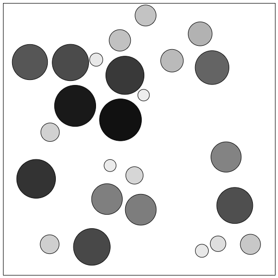

# Elastic Circle Collision Resolution

This is an implementation of an algorithm that performs exact elastic circle (and container box) collision resolution. No approximation. It is not useful for real time applications with more complex scenes, because the runtime of the algorithm increases significantly on the collision rate. Each iteration takes O(n^2*m) time, where n is the number of objects and m is the number of collisions.

## The Algorithm:

1. Find the time of the next collision in the system
2. Advance objects to that time
3. Resolve collisions
4. Repeat if desired time not reached

## Screenshot:

